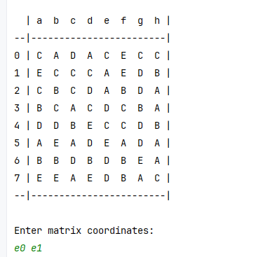
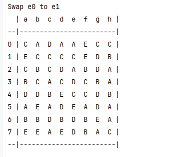
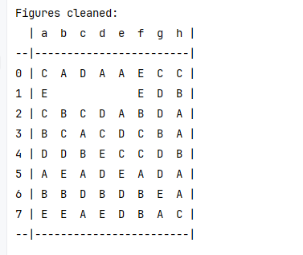
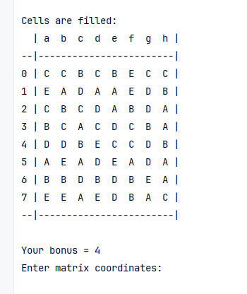

### Ирга 3 - в - ряд

### Правила игры:
В начале игры в консоль выводится матрица, заполненная буквами случайным образом. 
Затем игрок вводит координаты клеток, которые надо обменять местами. После этого из матрицы удаляются фигуры, которые составлены из трех и более клеток с одинаковыми буквами. На пустые места "падают" буквы, расположенные сверху. Остальные места заполняются случайными буквами.

#### Требования:
Для запуска требуется JDK 11+.

#### Запуск:
```
1. git pull 
2. cd "$директория проекта"
2. javac -d out @sources.txt
3. java -classpath out threeinarow.Main
```

#### Игра:

1. При старте игры выводится сетка, заполненная случайным образом буквами.
2. Игрок вводит координаты клеток, которые надо обменять, и нажимает Enter.



3. Следующий слайд показывает матрицу после обмена клеток. 



4. Следующий слайд показывает матрицу, после того как получившиеся фигуры удалены.



5. Следующий слайд показывает матрицу, после того как буквы "упали" и заполнили пустые места, и после того, как 
   случайным образом заполнились верхние пустые клетки. 
 Также выводится сумма бонусов, полученных игроком за раунд.




Игра заканчивается, когда игрок вводит координаты клеток, после обмена которых на поле не окажется фигур. 